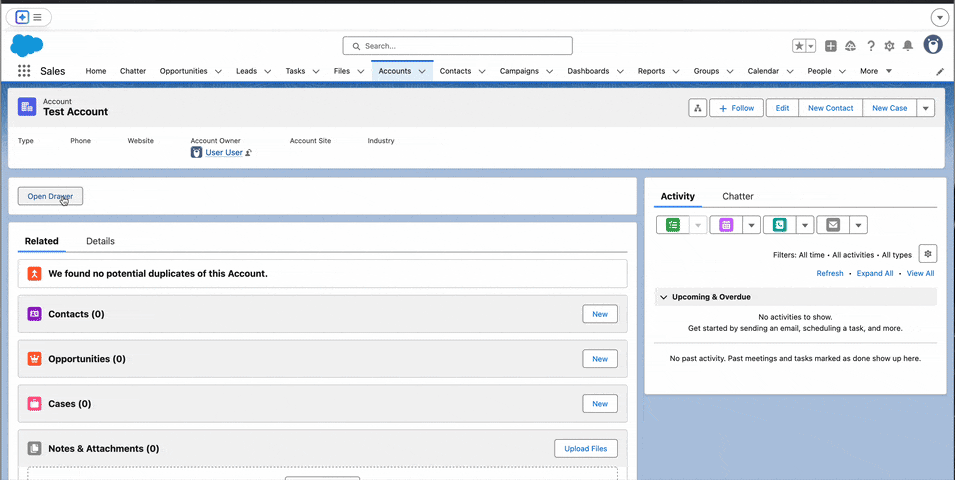

# LWC Drawer

  

A customizable drawer component for Lightning Experience that creates a full-viewport overlay with a configurable sidebar. This component allows developers to build their own drawer content while providing a consistent overlay experience that integrates seamlessly with the Lightning design system.

## Features

- Full viewport overlay
- Customizable sidebar content
- Lightning Experience integration
- Responsive design
- Accessible implementation

## Usage

Import and use the drawer component in your Lightning Web Components to create slide-out panels for navigation, forms, or any custom content that requires a focused user experience.
